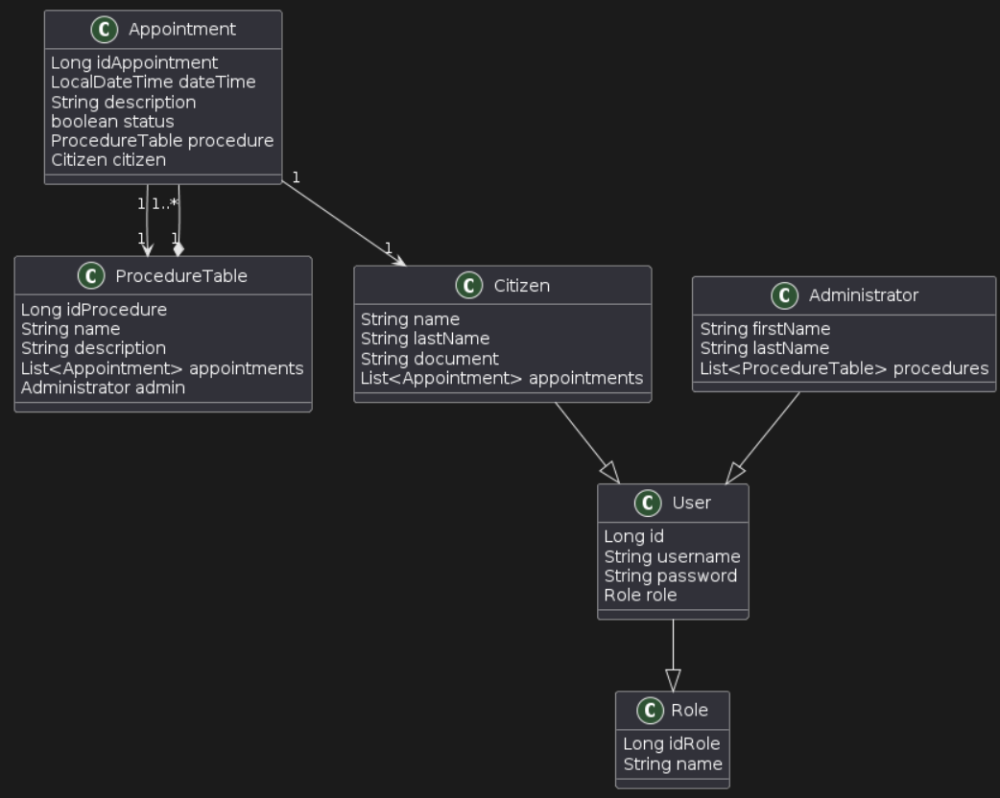
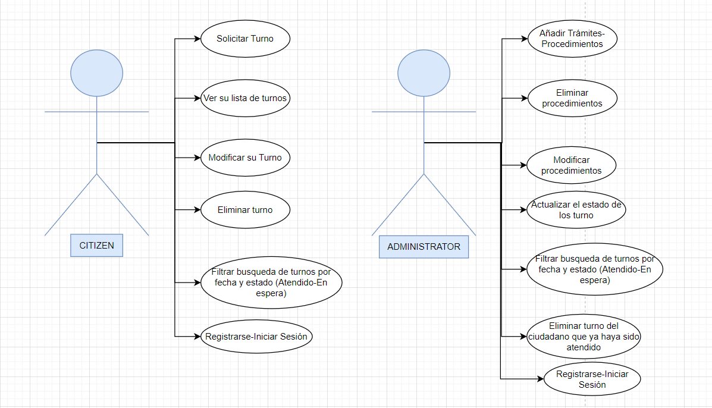

# 

# Gestión de Turnos

## Descripción

Esta aplicación Java Web permite gestionar turnos para trámites. Los usuarios pueden agregar nuevos turnos, listarlos según fecha y filtrarlos por estado (En Espera o Ya Atendidos).

## Funcionalidades

- **Agregar Turno:** Ingresar información sobre un nuevo turno, incluyendo, fecha, descripción del trámite y ciudadano asignado.
- **Listar Turnos:** Visualizar todos los turnos junto con sus ciudadanos asignados, filtrados por fecha.
- **Filtrar Turnos:** Seleccionar turnos "En Espera" o "Ya Atendidos", filtrados por fecha.

  <h3 style="color:#333;">Rol (<b>Role</b>)</h3>
  
Representa roles en el sistema.

  
Relación uno a muchos con la clase <b>User</b>, lo que significa que varios usuarios pueden tener el mismo rol.

  <h3 style="color:#333;">Usuario (<b>User</b>)</h3>
  
Representa usuarios en el sistema.

  
Relación muchos a uno con la clase <b>Role</b>, lo que significa que cada usuario pertenece a un único rol.

  <h3 style="color:#333;">Ciudadano (<b>Citizen</b>)</h3>
  
Representa ciudadanos en el sistema.

  
Extiende la clase <b>User</b>.

  
Relación uno a muchos con la clase <b>Appointment</b>.

  
Puede tener múltiples citas.

  <h3 style="color:#333;">Cita (<b>Appointment</b>)</h3>
  
Representa citas en el sistema.

  
Relaciones muchos a uno con las clases <b>Citizen</b> y <b>ProcedureTable</b>, lo que significa que una cita pertenece a un ciudadano y a un procedimiento.

  <h3 style="color:#333;">Tabla de Procedimientos (<b>ProcedureTable</b>)</h3>
  
Representa procedimientos disponibles en el sistema.

  
Relación uno a muchos con la clase <b>Appointment</b>, lo que significa que un procedimiento puede tener múltiples citas asociadas.

  <h3 style="color:#333;">Administrador (<b>Administrator</b>)</h3>
  
Representa administradores en el sistema.

  
Extiende la clase <b>User</b>.

  
Puede gestionar múltiples procedimientos.

## Explicación breve del proyecto

**Persistencia:** 
   * Este componente proporciona clases para interactuar con la base de datos y realizar operaciones CRUD. Las clases incluyen controladores JPA para administradores, procedimientos, turnos, ciudadanos, usuarios y roles. La clase PersistenceController actúa como una capa de abstracción sobre estos controladores, simplificando la interacción con la base de datos desde la lógica de la aplicación.

**Métodos:**

  
* `registerAdmin`: Registra un nuevo administrador en el sistema con los siguientes parámetros: nombre, apellido, lista de procedimientos, nombre de usuario y contraseña. El método busca el rol "ADMIN" en la base de datos, crea un administrador y lo persiste.

* `createCitizen`: Crea un nuevo ciudadano en el sistema con los siguientes parámetros: nombre, apellido, documento, lista de turnos, nombre de usuario y contraseña. El método busca el rol "CITIZEN" en la base de datos, crea un ciudadano y lo persiste.

* `findRoleByName:`Se obtiene la lista de todos los roles disponibles en la base de datos, filtra la lista de roles,para encontrar un nombre que coincida con el pasado por el parametro, si coincide se devuelve ese nombre, sino se devuelve null .

* `createProcedure`: Crea un nuevo procedimiento con los siguientes parámetros: nombre, descripción, lista de turnos y administrador responsable. El procedimiento se crea y persiste en la base de datos.

* `updateStatus`: Método utilizado por el administrador para actualizar el estado de los turnos. Marca como atendidos o no atendidos los turnos según la fecha de turno.

* `createAppointment`: Crea un nuevo turno con los siguientes parámetros: fecha y hora, descripción, procedimiento y ciudadano.

* `filterAppointmentsByCitizen`: Filtra los turnos para que el ciudadano solo pueda ver sus propios turnos.

* `filterByDate`: Filtra los turnos por fecha.

* `filterByDateStatus`: Filtra los turnos por fecha y estado.

* `deleteAppointmentByAdmin`: Verifica si un turno puede ser eliminado por el administrador. Realiza los siguientes pasos:

    1. Obtiene la lista de citas desde la capa de persistencia.
    2. Filtra las citas para encontrar aquellas que han sido atendidas y cuyo documento del ciudadano coincide con el proporcionado por el administrador.
    3. Si se encuentra un turno que cumple estas condiciones, se procede a eliminarlo.
    4. Si no se encuentra ningún turno que cumpla las condiciones, se lanza una excepción `NoAppointmentException`, indicando que no se puede eliminar el turno debido a que el ciudadano no ha sido atendido o el documento no coincide.

**Casos de uso:**
- Descripcion de las acciones de los dos tipos de usuarios: CITIZEN y ADMIN

## ⚙️ Requisitos del sistema

- Java Development Kit (JDK) instalado en el sistema.
- Acceso a una base de datos relacional compatible. Se ejecuta el archivo.sql con los datos de prueba del sistema de gestión de turno.

- Una vez que hayas descargado el archivo SQL y lo hayas importado en tu base de datos, se crearán automáticamente las tablas y los campos necesarios. En particular, se crearán los campos "ADMIN" y "CITIZEN" en la tabla de roles, que se utilizarán posteriormente para registrar y autenticar a los usuarios en la aplicación.

- Configurar la conexión a la base de datos en el archivo de configuración correspondiente.
- Configuración del proyecto y ejecución desde un IDE de desarrollo.(Netbeans, Eclipse..)

## Supuestos 
- Se da por hecho que el usuario se registra con datos válidos, ya que actualmente no se implementan métodos de validación de datos. Esto aplica tanto para el registro de usuarios como para el registro y login de administradores.

- Se supone que el administrador conoce el DNI del ciudadano para poder eliminar su correspondiente turno 
   
